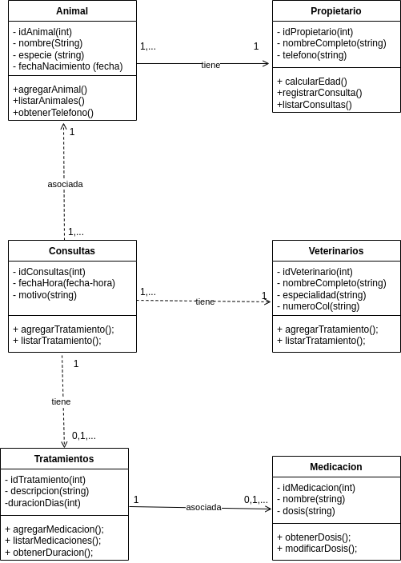

# UT4-A2 Sistema de Gestión de un Centro Veterinario

El Centro Veterinario **“VetCare+”** desea modelar su sistema interno de gestión de pacientes, visitas, tratamientos y personal sanitario. El objetivo es construir un **diagrama de clases UML**  basado en el dominio descrito a continuación. 

> 🚨 El modelo final debe contener exclusivamente aquello que aparece escrito y debe respetar todas las relaciones, cardinalidades y atributos indicados.

En el centro se registran animales atendidos clínicamente. Cada **animal** dispone de los atributos:
- `idAnimal` (int)
- `nombre` (string)
- `especie` (string)
- `fechaNacimiento` (fecha)

Cada Animal pertenece exactamente a un **propietario**, . El **propietario** debe incluir los atributos siguientes:

- `idPropietario` (int)
- `nombreCompleto` (string)
- `telefono` (string)

Un **propietario** siempre tiene al menos un **animal**, pudiendo tener varios.

El centro cuenta con personal formado por **veterinarios**, cada uno con:

- `idVeterinario` (int)
- `nombreCompleto` (string)
- `especialidad` (string)
- `numeroCol` (string)

Los **veterinarios** registran **consultas**, que incluyen:

- `idConsulta` (int)
- `fechaHora` (fecha-hora)
- `motivo` (string)

Cada **consulta** está asociada a un único **animal** y es realizada por un único **veterinario**. Un **animal** puede tener muchas **consultas** a lo largo del tiempo, al igual que un **veterinario**.

Tras algunas Consultas, el Veterinario prescribe **tratamientos**, cada uno con:

- `idTratamiento` (int)
- `descripcion` (string)
- `duracionDias` (int)

Cada **tratamiento** pertenece a una única **consulta**, y una **consulta** puede tener ninguno, uno o múltiples **tratamientos**.

Algunos **tratamientos** requieren **medicaciones**, que incluyen:

- `idMedicacion` (int)
- `nombre` (string)
- `dosis` (string)

Cada **medicación** está asociada exclusivamente a un único **tratamiento**.  Un **tratamiento** puede tener cero, una o varias **medicaciones**.

> El diagrama final deberá incluir únicamente las clases mencionadas (Propietario, Animal, Veterinario, Consulta, Tratamiento, Medicacion), con todos los atributos indicados y las relaciones y cardinalidades exactas.

Para cada una de las clases se deben implementar los siguientes **métodos**:

- #### Propietario

    - `agregarAnimal()`
    - `listarAnimales()`
    - `obtenerTelefono()`

- #### Animal

    - `calcularEdad()`
    - `registrarConsulta()`
    - `listarConsultas()`

- #### Veterinario

    - `registrarConsulta()`
    - `listarConsultasRealizadas()`

- #### Consulta

    - `agregarTratamiento()`
    - `listarTratamientos()`

- #### Tratamiento

    - `agregarMedicacion()`
    - `listarMedicaciones()`
    - `obtenerDuracion()`

- #### Medicacion

    - `obtenerDosis()`
    - `modificarDosis()`

A continuación se muestra el **diagrama de clases** realiazado:

